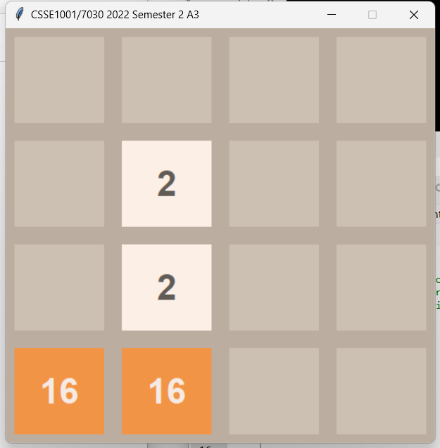

# CSSE1001 Python 2048 Game Project

Welcome to our project repository! This is a small, engaging project designed specifically for the University of Queensland's first-year students enrolled in the CSSE1001 course. Our focus is on providing an extracurricular learning aid that's both fun and educational.

## Project Overview

At the heart of this repository is a Python-based implementation of the popular 2048 game. It's an excellent tool for students to understand the intricacies of GUI programming in Python. Through this project, we aim to enhance the learning experience by offering a practical application of course concepts.

## Key Features

- **Game Mechanics:** Utilize the classic 'W', 'A', 'S', 'D' keys for movement control, offering an intuitive and familiar gameplay experience.
- **GUI Implementation:** The game is built using robust GUI frameworks, providing a visual and interactive way for students to engage with Python programming.
- **Learning Focus:** The primary objective is to aid students in grasping the fundamentals of GUI interaction and Python programming in a more hands-on and relatable context.

## Getting Started

To get started with this project:
1. Clone the repository.
2. Ensure you have Python installed.
3. Run the game and dive into the code to explore how it's structured and functions.

We hope this project will serve as a valuable resource for CSSE1001 students, helping them to better understand and enjoy the world of Python and GUI programming. Happy coding!

